# Quest Engine - Flow Charts & Architecture

## 🎯 Quest Engine Complete Flow Charts

---

## 📊 Main Quest System Flow

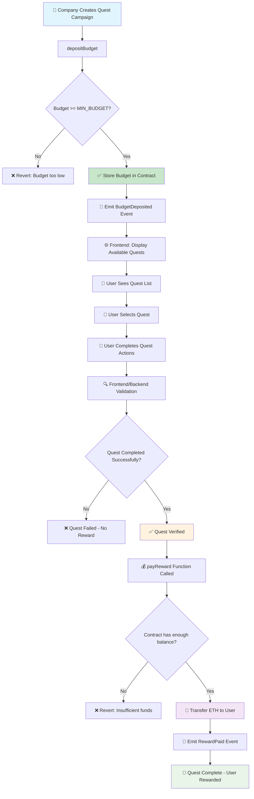

---

## 🔄 Detailed Function Flow

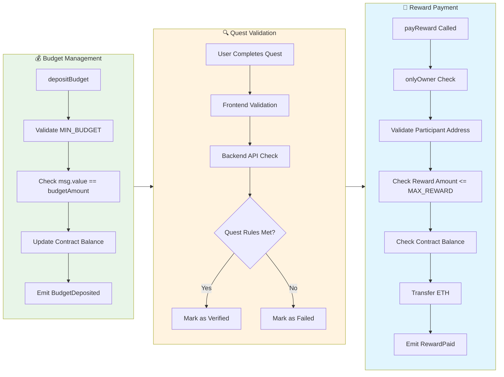

---

## 🛡️ Security & Access Control Flow

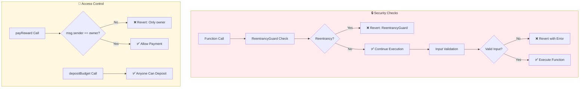

---

## 📱 Frontend Integration Flow

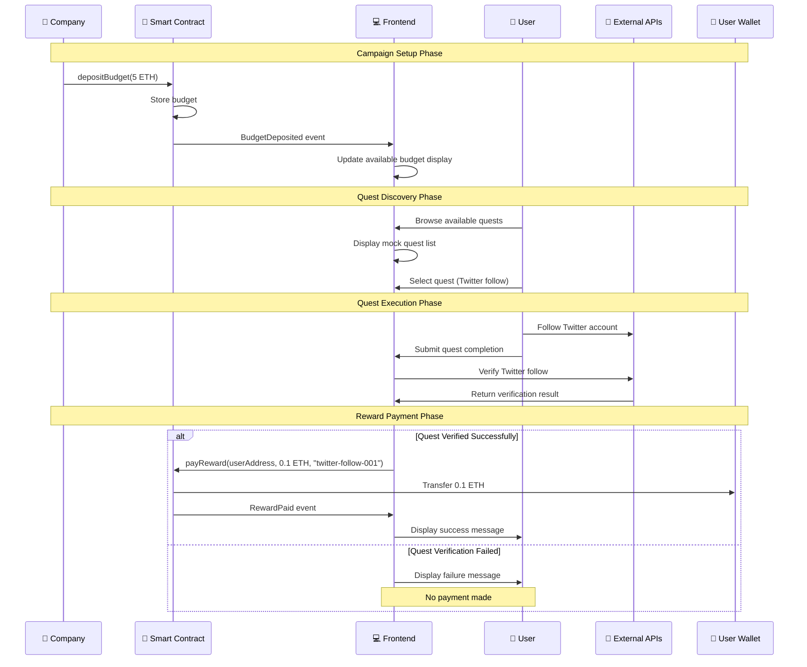

---

## 🎯 Quest Types Architecture

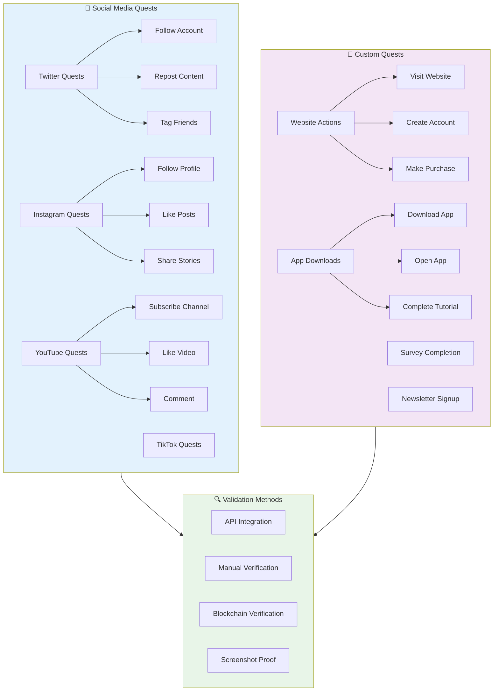

---

## 💰 Payment & Reward Flow

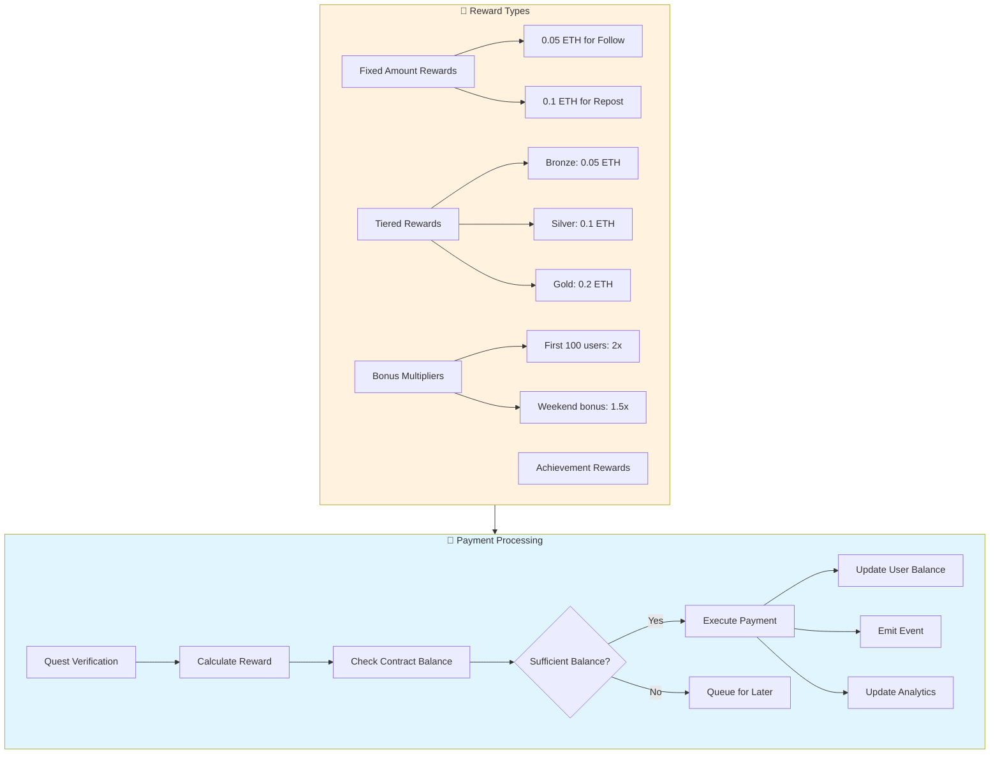

---

## 🌐 Multi-Platform Quest Architecture

```mermaid
flowchart LR
    subgraph Platforms["📱 Social Platforms"]
        direction TB
        P1[Twitter API]
        P2[Instagram API]
        P3[YouTube API]
        P4[TikTok API]
        P5[LinkedIn API]
    end
    
    subgraph Validation["🔍 Validation Layer"]
        direction TB
        V1[API Validator]
        V2[Manual Reviewer]
        V3[AI Checker]
        V4[Community Voting]
    end
    
    subgraph Contract["📜 Smart Contract"]
        direction TB
        C1[Budget Pool]
        C2[Payment Engine]
        C3[Event Logger]
    end
    
    subgraph Analytics["📊 Analytics"]
        direction TB
        A1[Quest Completion Rates]
        A2[Reward Distribution]
        A3[User Engagement]
        A4[ROI Tracking]
    end

    Platforms --> Validation
    Validation --> Contract
    Contract --> Analytics

    style Platforms fill:#e3f2fd
    style Validation fill:#e8f5e8
    style Contract fill:#fff3e0
    style Analytics fill:#f3e5f5
```

---

## 🔄 Quest Lifecycle Management

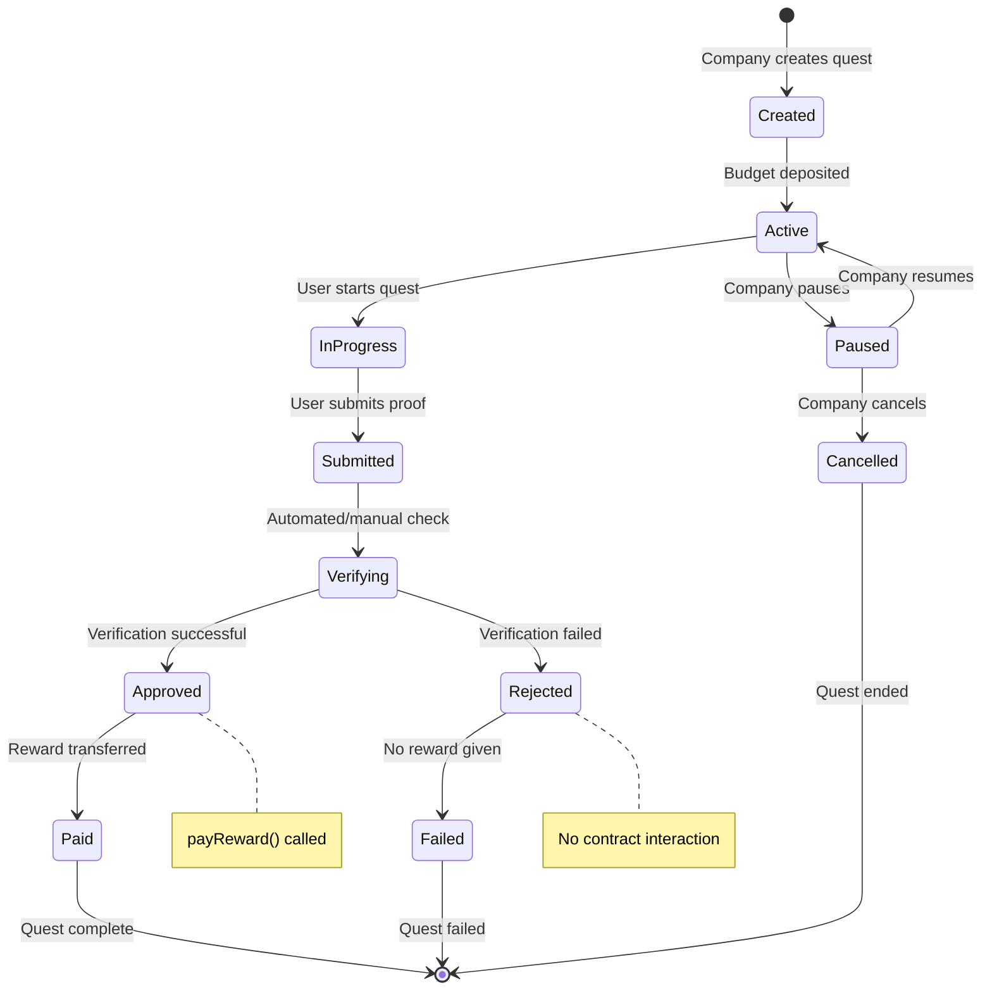

---

## 🏗️ System Architecture Overview

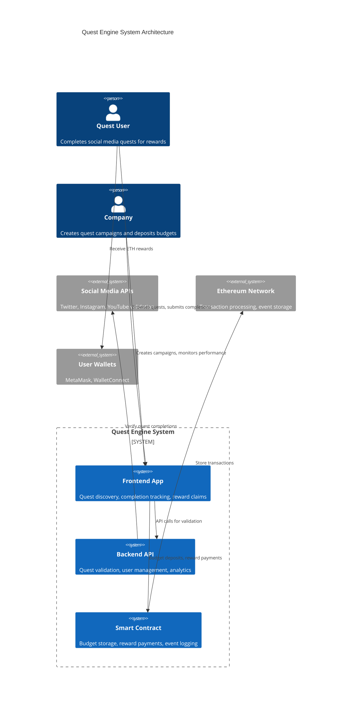

---

## 🧪 Testing Flow Architecture

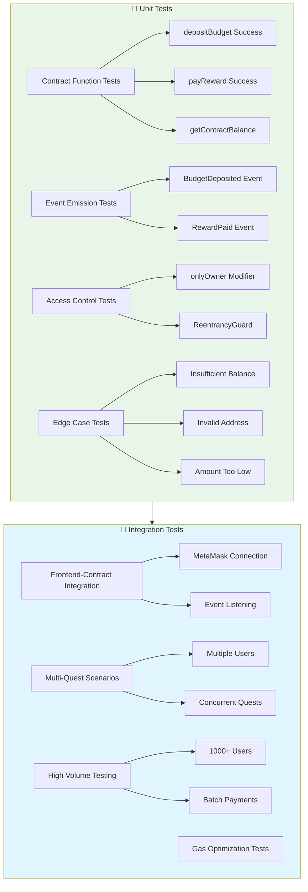

---

## 📈 Analytics & Monitoring Flow

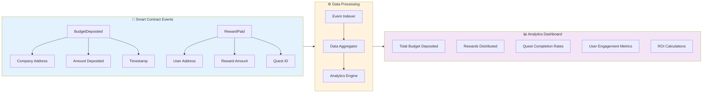

---

## 🚨 Error Handling & Recovery Flow

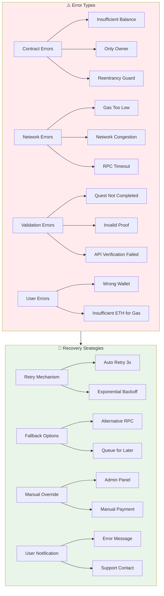

---

## 🎯 Quest Campaign Management Flow

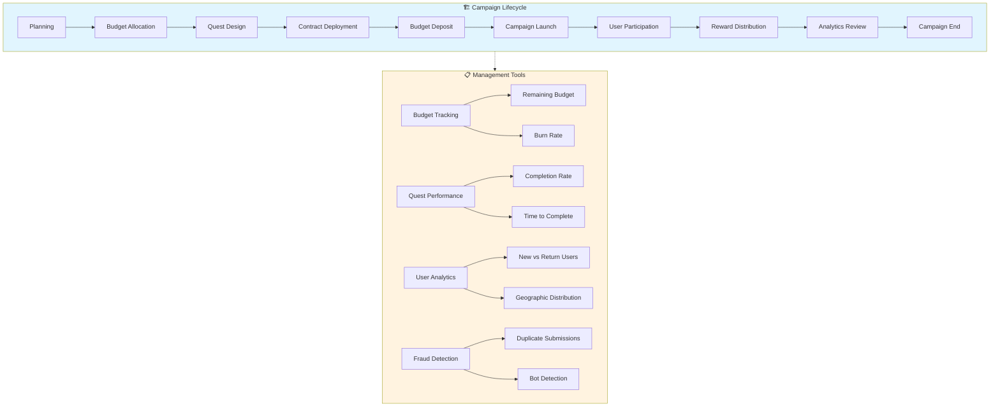

Bu flow chart'lar Quest Engine'in tüm aspect'lerini kapsar:

- **Ana sistem akışı**
- **Fonksiyon detayları** 
- **Güvenlik kontrolleri**
- **Frontend entegrasyonu**
- **Quest türleri ve validasyon**
- **Ödeme süreçleri**
- **Test mimarisi**
- **Analytics ve monitoring**
- **Hata yönetimi**
- **Kampanya yönetimi**

Her chart farklı bir bakış açısı sunar ve entegrasyon sırasında referans olarak kullanılabilir! 🚀
